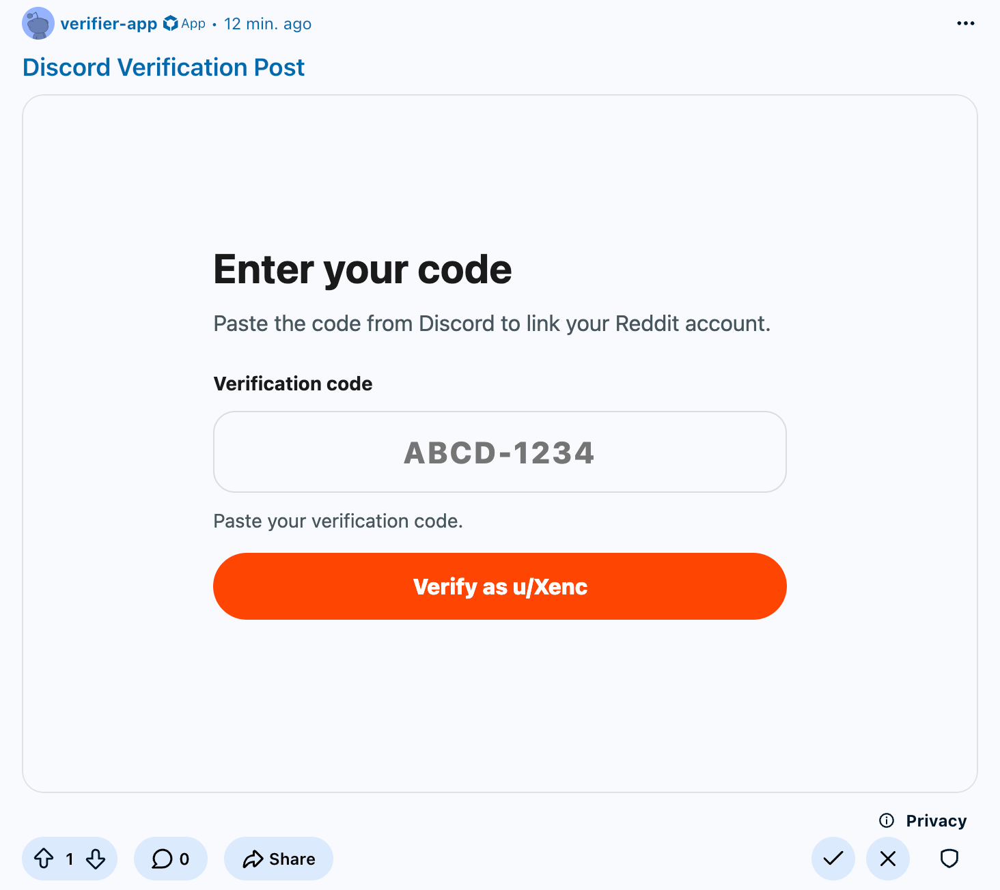

# Devvit Discord Verifier



## Verification Flow

1. Discord bot gives user a short verification code.
2. User opens the Reddit custom post and enters code.
3. Devvit server receives the code and attaches trusted Reddit context.
4. Devvit sends the payload to the Discord bot backend.
5. The bot accepts or rejects the verification.

The Devvit payload sent to Discord looks like:

```json
{
  "type": "reddit_verification",
  "code": "ABCD-1234",
  "redditUserId": "t2_...",
  "redditUsername": "example_user",
  "subredditName": "exampleSubreddit",
  "postId": "t3_...",
  "verifiedAt": "2026-06-06T13:00:00.000Z"
}
```

The bot backend receives this as a POST with header `X-Devvit-Verification-Secret`. Return any `2xx` for success. Return `4xx` for invalid, expired, or already-used codes.

## Setup

The example `devvit.json` includes:

```json
  "name": "devvit-discord",
```

Change this to the username of a Devvit app created by the developer in `devvit whoami`.

```json
"dev": {
  "subreddit": "test_subreddit"
}
```

Change this to a different test subreddit to avoid providing it each time in `devvit playtest <subreddit>`.

Then, from this folder:

```sh
npm install
npm run build
npm run dev
```

## Configuring Handshake

Both required values are secrets stored per installation, and are defined in `devvit.json`:

- `verifyEndpoint` — HTTPS route your backend exposes for verification
- `sharedSecret` — sent as the `X-Devvit-Verification-Secret` header

Configure them for the test subreddit via CLI once installed there:

```sh
devvit settings set verifyEndpoint --subreddit playtest_subreddit
devvit settings set sharedSecret --subreddit playtest_subreddit
```

The server reads them with `settings.get(...)` in `src/server/index.ts`. These are not exposed to the client.

To have these secrets be used by every install of the app across different subreddits, move either field from `settings.subreddit` to `settings.global` in `devvit.json`.

Global settings can then be set with `devvit settings set <name>` (no `--subreddit`).

## Post Creation

The app adds one subreddit moderator menu item:

```text
Create verification post
```

This opens a form for the post title and submits a custom post using the `default` entrypoint as the logged in user.

## Structure

- `public/verify.html`: custom post layout
- `public/verify.css`: custom post styles
- `src/client/verify.ts`: browser form behavior
- `src/server/index.ts`: Discord handshake and post creation
- `devvit.json`: app name, subreddit settings, HTTP permission, custom post entrypoint, and menu item
